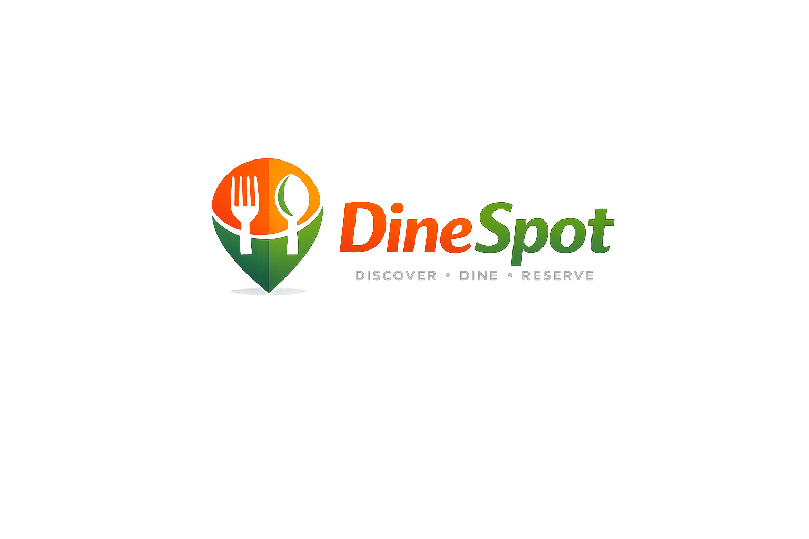

<div align="center">



# DineSpot Client

### Restaurant discovery, reservation and review platform

[](https://nextjs.org/)
[](https://react.dev/)
[](https://www.typescriptlang.org/)
[](https://tailwindcss.com/)

[Server Repository](https://github.com/Tahaimage8/DineSpot-server)

</div>

## About the Project

DineSpot is a full-stack restaurant discovery and reservation platform. It allows customers to explore approved restaurants, request table reservations and share reviews after completed visits.

Restaurant owners can manage their restaurant, reservation requests and customer feedback. Administrators can manage users, restaurants, reservations and reviews from a role-based dashboard.

This project was built as a learning and portfolio project to practise full-stack development, authentication, protected routes, REST API integration and role-based access control.

## Main Features

### Public Features

- Responsive home page
- Browse approved restaurants
- Search restaurants by name, cuisine or location
- View restaurant details
- Light and dark themes
- Responsive design for desktop, tablet and mobile

### Customer Features

- Register and log in as a customer
- Request restaurant reservations
- View personal reservations
- Cancel pending or confirmed reservations
- Review completed reservations
- Edit or delete personal reviews
- View personal dashboard, analytics and profile

### Restaurant Owner Features

- Register as a restaurant owner
- Add and manage one restaurant
- Upload restaurant images through ImgBB
- Track restaurant approval status
- View reservation requests
- Confirm, reject or complete reservations
- View customer reviews and rating summaries
- Access owner overview, analytics and profile pages

### Admin Features

- View platform overview
- Manage registered users
- Change user role and account type
- Block or unblock users
- Approve, reject or delete restaurants
- View and delete reservations
- View and delete reviews
- Access real-data analytics and profile pages

### Access Control

- Role-based dashboard navigation
- Protected customer, owner and admin routes
- Blocked users cannot access protected dashboard pages
- Blocked users are redirected away from restaurant detail routes
- Protected server requests use the active Better Auth session token

## User Roles

| Role | Access |
|---|---|
| Customer | Explore restaurants, reserve tables and submit reviews |
| Restaurant Owner | Manage a restaurant, reservations and reviews |
| Admin | Manage users, restaurants, reservations and reviews |

## Technology Stack

- **Framework:** Next.js App Router
- **Language:** TypeScript
- **UI:** React, Tailwind CSS and HeroUI
- **Animation:** Motion
- **Icons:** React Icons and Gravity UI Icons
- **Authentication:** Better Auth
- **Database Adapter:** MongoDB Native Driver
- **Notifications:** React Toastify
- **Image Hosting:** ImgBB
- **Theme Management:** next-themes
- **API Communication:** Server actions and REST API helpers

## Project Structure

```text
src/
├── app/
│   ├── (main)/                 # Public pages
│   ├── api/auth/               # Better Auth route
│   ├── blocked/                # Blocked account page
│   └── dashboard/              # Role-based dashboard pages
├── components/
│   ├── auth/
│   ├── dashboard/
│   ├── home/
│   ├── reservations/
│   ├── restaurants/
│   ├── reviews/
│   └── shared/
├── lib/
│   ├── actions/                # Server actions
│   ├── api/                    # Backend API functions
│   ├── core/                   # Session and request helpers
│   ├── auth.ts
│   └── mongodb.ts
└── types/
```

## Getting Started

### Prerequisites

- Node.js 20 or later
- npm
- MongoDB Atlas database
- ImgBB API key
- Running DineSpot server

### Installation

```bash
git clone https://github.com/Tahaimage8/DineSpot-client.git
cd DineSpot-client
npm install
```

### Environment Variables

Create a `.env.local` file in the project root:

```env
MONGODB_URI=your_mongodb_connection_string
MONGODB_DB_NAME=dinespot

BETTER_AUTH_SECRET=your_long_random_secret
BETTER_AUTH_URL=http://localhost:3000

SERVER_API_URL=http://localhost:5000
IMGBB_API_KEY=your_imgbb_api_key
```

Do not commit `.env.local` or expose secret values publicly.

### Run the Development Server

```bash
npm run dev
```

Open:

```text
http://localhost:3000
```

### Check the Project

```bash
npm run lint
npm run build
```

## Important Routes

| Route | Purpose |
|---|---|
| `/` | Home page |
| `/explore` | Approved restaurant list |
| `/explore/[id]` | Restaurant details, reservation and reviews |
| `/login` | User login |
| `/register` | Customer or owner registration |
| `/dashboard` | Role-based overview |
| `/dashboard/reservations` | Reservation management |
| `/dashboard/reviews` | Review management |
| `/dashboard/analytics` | Role-based analytics |
| `/dashboard/profile` | Account profile |
| `/dashboard/users` | Admin user management |
| `/dashboard/restaurants` | Admin restaurant management |
| `/dashboard/my-restaurants` | Owner restaurant management |

## Related Repository

The Express and MongoDB REST API is available here:

**DineSpot Server:**  
https://github.com/Tahaimage8/DineSpot-server

## Project Notes

- Restaurant content is loaded from the database.
- Ratings and review counts are calculated from submitted reviews.
- Reviews require a completed customer reservation.
- Restaurant owners can create only one restaurant.
- New restaurants require admin approval before appearing publicly.
- This is a learning and portfolio project and may continue to receive improvements.

## Author

**Taha Image**

- GitHub: [@Tahaimage8](https://github.com/Tahaimage8)

---

<div align="center">

Built with Next.js, TypeScript and MongoDB.

</div>